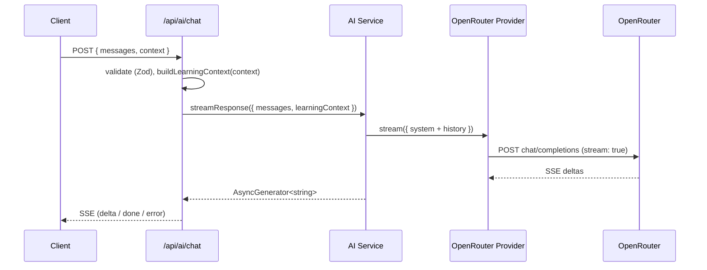

# AI Architecture — Tuto's Foundation

Status: **foundation complete and now considered stable — Sprints 4-5
onward are feature sprints built on top of it, not further architecture
changes.** Sprint 1 built the provider/prompt/service/API plumbing;
Sprint 2 made Tuto context-aware; Sprint 3 gave Tuto six real tools
backed by mock data; Sprint 4 shipped Vocabulary Intelligence
(`POST /api/ai/vocabulary`); Sprint 5 (this update) shipped Article
Intelligence — four of its nine capabilities needed *zero new code*
(they're ordinary `/api/ai/chat` turns once the right context fields are
set), and the rest needed exactly one small, justified addition each to
the tool and prompt layers, plus one new consolidated route
(`POST /api/ai/article`) rather than three feature-specific ones. No UI
component calls any AI route yet — this remains backend architecture +
API surface, not a wired-up screen.

Companion to `docs/coding-standards.md` (general conventions) and
`docs/domain-model.md` (the app's actual data model, which the AI module
deliberately does not import from — see "Why the AI module doesn't import
app types" below).

---

## Why this exists

Before this sprint, "AI" in this codebase meant two narrow, non-conversational
things: `src/lib/gemini/client.ts` (a one-shot structured-JSON call the
Content Engine uses to enrich ingested articles/podcasts) and
`src/lib/tuto/messages.ts` (a fully deterministic, rules-based note
generator for the dashboard — no LLM call at all). Neither is reusable for
"Tuto talks back to a learner." This sprint builds that foundation once,
so every future conversational feature is a new call site, never a new
architecture.

---

## The nine pieces

### 1. Providers — `src/ai/providers/`

`AIProvider` (`types.ts`) is the contract: `complete()` for a full
response (optionally offered a `tools` list and able to return
`toolCalls`, added in Sprint 3; optionally given a `responseFormat` — a
name plus a JSON Schema — to constrain its answer to valid JSON, added in
Sprint 4), `stream()` for an async-generator of text deltas (text-only —
see "Streaming + tools" below for why). Everything above this layer (the
service, the API route) only ever talks to this interface.

`openrouter/client.ts` is the first (and today, only) implementation —
a thin `fetch()` wrapper against OpenRouter's OpenAI-compatible
`chat/completions` endpoint, in both streaming (SSE) and non-streaming
form. `OPENROUTER_API_KEY` and `OPENROUTER_MODEL` are read from
`process.env` on every call — nothing about which model Tuto talks to is
hardcoded; changing `OPENROUTER_MODEL` is a config change, not a deploy.

`registry.ts` + `bootstrap.ts` mirror the Content Engine's own provider
pattern (`src/lib/content-engine/providers/registry.ts` /
`bootstrap.ts`) on purpose, for a reader already familiar with one to
recognize the other immediately: a `Map<id, AIProvider>`, a
`registerProvider()`/`getProvider()` pair, and an idempotent bootstrap
that registers every real provider once per server instance.

`index.ts`'s `getDefaultProvider()` reads `AI_PROVIDER` (defaults to
`"openrouter"`) and returns the matching registered provider. **Adding a
second provider is one new file under `providers/<name>/` plus one line
in `bootstrap.ts` — nothing else changes.**

### 2. Prompts — `src/ai/prompts/tuto/`

`sections.ts` holds each concern (personality, teaching philosophy, active
learning, CEFR-adaptive explanations, teaching modes, grammar correction
style, encouragement style, follow-up learning, educational priorities,
refusal behavior, formatting rules) as an independent, named constant —
editing how Tuto corrects grammar never touches how it encourages. The
teaching-specific concerns (active learning, teaching modes, follow-up
learning, and the CEFR rewrite) were added/rewritten in Sprint 7 — see
"Teaching Framework" below for why each exists and what it changed.

`context-block.ts` (Sprint 2) is the prompt-enrichment renderer: it turns
a `LearningContext` into a labeled-block instruction —

```
User is studying:
Podcast

Podcast title:
Everyday Conversations Vol. 3

Selected sentence:
I couldn't agree more.

User level:
B1

Learning goal:
IELTS 7
```

— rendering only the fields the caller actually populated (never
fabricates a level, goal, or selection that wasn't provided) and
returning `null` for an empty context so no block gets appended at all.
Kept in its own file, separate from `index.ts`'s section-joining, because
it's the piece most likely to grow as more context fields ship.

`index.ts`'s `buildTutoSystemPrompt(context?)` joins the sections, and —
when `context-block.ts` produced one — appends the block under a short
instruction ("Use it naturally in your response — don't just repeat it
back"), directly serving the brief's "The AI should naturally use this
context."

### 3. Context Engine — `src/ai/context/`

`types.ts` defines `LearningContext` (Zod schema + inferred type).
Every field is nullable, optional at the call site, and independent of
every other field — a caller sends only what it actually knows:

| Field | Shape | Notes |
|---|---|---|
| `currentScreen` | `Screen` enum | Home, Podcast, Article, Quiz, Vocabulary, Daily Mission — extend the enum for a new screen, nothing else changes |
| `currentActivity` | `string` | Free-form, e.g. "reading the transcript" — this module doesn't validate its vocabulary |
| `currentLesson` / `previousLesson` | `TitledReference` (`{id, title}`) | Just a pointer — no transcript/body, that's the "no podcast/article analysis" boundary |
| `currentPodcast` / `currentArticle` / `currentQuiz` | `TitledReference` | Same shape, one per content type so the prompt can say "Podcast title" vs "Article title" |
| `selectedWord` / `selectedSentence` / `selectedParagraph` | `string` | Whatever text the learner has selected right now |
| `transcriptTimestamp` | `number` (seconds, ≥0) | Position in an audio/video transcript, if one is playing |
| `userLevel` | `CefrLevel` enum | The module's own A1–C2 union, not the app's |
| `learningGoal` | `string` | Free-form — the AI module doesn't own the canonical goal list |
| `streak` | `number` (int, ≥0) | Consecutive days |
| `xp` | `number` (int, ≥0) | Total experience points |

`builder.ts`'s `buildLearningContext()` normalizes a partial object into
a complete one via `LearningContextSchema.parse()`, defaulting anything
unset to `null` — this is also where an invalid value (a negative streak,
an unrecognized CEFR level) gets rejected, and the same schema backs the
API route's request validation, so a bad `context` in an HTTP request
fails exactly the same way.

**Nothing calls `buildLearningContext()` from a real screen yet** — this
is the architecture, not the wiring. The natural future call sites are
each learning-session step component (`src/components/learning-session/`)
and the dashboard, passing whatever they already know (current CEFR
level, the content on screen, a selected word) into the API request body.

Sprint 1 shipped a single generic `currentContent: {contentType, id,
title}` field instead of the three type-specific fields above — replaced
in Sprint 2 once the brief asked for `currentPodcast`/`currentArticle`/
`currentQuiz` distinctly. Safe to change in place: nothing outside this
module referenced the old field yet.

### 4. Schemas — `src/ai/schemas/`

Zod schemas (and their inferred TypeScript types) for every message shape:
`UserMessageSchema`, `AssistantMessageSchema`, `SystemMessageSchema`, the
`ConversationMessageSchema` discriminated union of all three,
`ToolResultSchema`, and `ConversationContextSchema` (a full request:
message history + optional partial `LearningContext`). These are the
runtime-validated boundary the API route enforces against — see "API
Route" below for why a client-supplied `"system"` message is rejected,
not silently dropped.

### 5. AI Service — `src/ai/services/`

The single entry point: `generateResponse()` (one full reply),
`streamResponse()` (an async generator of text deltas), and
`generateStructuredResponse<T>()` (Sprint 4 — a full reply constrained to
valid JSON matching a Zod schema), all in `ai-service.ts`. **No UI, no
API route, no future feature should ever import from `src/ai/providers`
or `src/ai/tools` directly** — everything goes through this service.

`generateStructuredResponse()` derives a JSON Schema from the caller's
Zod `resultSchema` via `z.toJSONSchema()` — one schema, two jobs: sent to
the provider as `responseFormat` to constrain its answer, and used again
afterward to `safeParse()` the returned JSON before it's trusted. Defense
in depth, not redundant — OpenRouter fans a request out to many different
underlying models, and not all of them honor strict JSON Schema mode
equally well. A parse or validation failure throws a catchable
`AIProviderError`, same error type every other service function already
uses, so the calling route doesn't need a second error-handling path.

`tool-loop.ts`'s `runToolLoop()` is the Tool Execution Layer (Sprint 3):

```
AI → Tool Selection → Execute Tool → Return Structured Result → Continue AI Response
```

It asks `src/ai/tools`'s registry for every registered tool (never a
hardcoded list), calls the provider with them attached, and — if the
provider responds with `toolCalls` instead of a final answer — executes
each one via `executeToolCall()`, appends a `"tool"` role message with
the JSON-stringified structured result, and calls the provider again.
This repeats until the provider answers with no further tool calls, or
`MAX_TOOL_ITERATIONS` (4) is hit, at which point one final call drops the
`tools` option entirely to force a plain answer — a safety valve against
a model stuck calling tools forever. `generateResponse()` surfaces every
tool call made along the way on the returned `AssistantMessage.toolResults`.

Both entry points still build the system prompt from the caller's
`LearningContext` exactly as Sprint 1/2 did; the tool loop only changes
what happens between sending that prompt and getting a final answer.

### 6. Tools — `src/ai/tools/` (Sprint 3: real tools, mock data)

`types.ts`'s `ToolDefinition<TArgs, TResult>` is the common interface
every tool implements: `name`, `description`, a JSON Schema `parameters`
for `TArgs`, an optional `resultSchema` (a Zod schema for `TResult`), and
`execute(args, context)`. The second parameter, `ToolExecutionContext`
(`{ learningContext }`), is how a tool named `getCurrentPodcast` knows
*which* podcast without the model ever having to guess or pass an id —
the AI Service supplies it from the request's own `LearningContext`
(Sprint 2), the model only ever supplies `TArgs`.

**The six tools** (`src/ai/tools/definitions/`), each mirroring the
brief's names exactly:

| Tool | Reads from context | Mock data source |
|---|---|---|
| `getCurrentPodcast` | `currentPodcast` | `MOCK_PODCASTS` |
| `getPodcastTranscript` | `currentPodcast` (+ optional `maxSegments` arg) | `MOCK_TRANSCRIPTS` |
| `getCurrentArticle` | `currentArticle` | `MOCK_ARTICLES` |
| `getCurrentQuiz` | `currentQuiz` | `MOCK_QUIZZES` (includes the answer key — Tuto needs it to explain *why* a choice is right) |
| `getSelectedVocabulary` | `selectedWord` | `MOCK_VOCABULARY` |
| `getLearningProgress` | `streak`/`xp`/`userLevel` (blended with supplemental mock stats context doesn't carry yet) | `MOCK_PROGRESS` |

Every tool degrades gracefully instead of throwing: no `currentPodcast` in
context → `{ found: false, reason: "..." }`, not an exception. All mock
data lives in one file, `mock-data.ts` — realistic static records, no
database, no Supabase, per this sprint's explicit rule.

**Registry** (`registry.ts`) mirrors `src/ai/providers/registry.ts`
exactly: a `Map<name, ToolDefinition>`, `registerTool()`/`getTool()`, plus
`listTools()` — the mechanism behind "the AI must be able to discover
tools automatically." Nothing in the AI Service (or anywhere else) lists
tool names by hand; it always calls `listTools()`. **Adding a seventh
tool is one new file under `definitions/` plus one line in
`bootstrap.ts` — nothing else changes,** same shape as adding a provider.

**Execution layer** (`execute.ts`)'s `executeToolCall()` is where "never
plain text" is actually enforced: it looks the tool up by name (unknown
name → structured error, not a throw), parses the model's JSON arguments
(malformed → structured error), runs `execute()`, and — when the tool
declared a `resultSchema` — validates the output against it before
handing it back. A tool that throws produces a structured `{ error: "..."
}` result, never an unhandled exception that would crash the
conversation.

### 7. Memory — `src/ai/memory/` (scaffolding only)

`MemoryStore` defines `get(conversationId)` / `set(conversationId,
summary)`. No implementation exists, and the AI Service does not
reference this module at all this sprint — seeing `MemoryStore` imported
anywhere outside `src/ai/memory` today would mean the "no memory
implementation" rule got broken. See "How memory will work" below.

### 8. Actions — `src/ai/actions/` (scaffolding only)

`ActionDefinition` defines the shape of something Tuto could *do* on the
learner's behalf (mark a lesson complete, navigate to a screen) — distinct
from a Tool, which only returns information. `registeredActions` is empty.

### API Route — `src/app/api/ai/chat/route.ts`

`POST /api/ai/chat`. Validates the body against `ChatRequestSchema` (a
Zod union of only `user`/`assistant` messages — a `"system"` role is
rejected with a 400, since Tuto's system prompt is always the service's
own). Normalizes the optional `context` into a full `LearningContext` via
`buildLearningContext()`, then streams the response back as
Server-Sent Events: `data: {"type":"delta","content":"..."}`,
`data: {"type":"done"}`, or — since the HTTP status and headers are
already committed once streaming starts — `data: {"type":"error","message":"..."}`
for any mid-stream failure. Verified locally end to end: malformed JSON →
400, an empty/invalid message array → 400 with field-level detail via
`z.treeifyError()`, a client-sent system message → 400, and a
well-formed request with no `OPENROUTER_API_KEY` configured → a clean SSE
error event rather than a crash. **Nothing about this route changed in
Sprint 3** — it still just calls `streamResponse()`; the tool loop is
entirely inside the service.

---

## Request flow

Two paths, depending on whether the model calls a tool.

**No tool needed** (identical to Sprint 1/2 — true token-by-token streaming):



**Tool needed** (Sprint 3 — the Tool Execution Layer, `tool-loop.ts`):

```mermaid
sequenceDiagram
    participant Service as AI Service
    participant Loop as runToolLoop
    participant Provider as OpenRouter Provider
    participant Tools as Tool Registry + Execution
    participant Client

    Service->>Loop: runToolLoop(provider, messages, learningContext)
    Loop->>Provider: complete({ messages, tools: listTools() })
    Provider-->>Loop: toolCalls: [getCurrentPodcast]
    Loop->>Tools: executeToolCall(call, { learningContext })
    Tools-->>Loop: { found: true, podcast: {...} } (structured JSON)
    Loop->>Provider: complete({ messages + tool result })
    Provider-->>Loop: final content, no more tool calls
    Loop-->>Service: { completion, toolResults }
    Service-->>Client: yields completion.content (single chunk)
```

### Streaming + tools

Once the tool loop runs, the final answer is delivered as a single
`yield` from `streamResponse()`, not incremental token deltas — a real
tradeoff, not an oversight. A tool call has to be a fully-formed
`{ name, arguments }` before it can be executed at all, so every turn
that might call a tool goes through `complete()`, never `stream()`.
Adding true token-level streaming *after* the last tool call resolves
would mean accumulating a provider's streamed `tool_calls` deltas
correctly (a well-known but genuinely fiddly parsing problem: arguments
arrive as partial JSON string fragments across many chunks) — real,
scoped future work, not attempted this sprint. `streamResponse()` still
checks `listTools().length === 0` and falls back to pure streaming when
true — in practice, since `bootstrap.ts` always registers the six
built-in tools, every real request goes through the tool loop today; the
empty-registry branch exists so the old pure-streaming behavior is still
reachable (and tested) rather than silently gone.

---

## Why the AI module doesn't import app types

`LearningContext.userLevel` is its own `CefrLevel` union
(`"A1"|"A2"|"B1"|"B2"|"C1"|"C2"`), not the app's `CefrLevel` from
`@/types/content`. `currentPodcast`/`currentArticle`/`currentQuiz` are all
the same generic `TitledReference` (`{id, title}`), not a
`PodcastContent`/`ArticleContent`/quiz type — deliberately too thin to
support "podcast analysis" or "article analysis" even by accident. This
is deliberate: the brief was "no feature-specific code," and importing
the app's content types would quietly couple the AI foundation to
whatever those types look like today. The app maps its own types onto
this shape at the call site (once a call site exists) — the AI module
never reaches back into `src/lib/content` or `src/types`.

Same principle in `src/ai/tools/mock-data.ts`: `MockPodcast`,
`MockArticle`, etc. are their own minimal shapes, not the app's
`PodcastContent`/`ArticleContent` from `@/types/content` — the tool
layer is exactly as self-contained as the context layer.

---

## Tool lifecycle

1. **Definition** — a file under `src/ai/tools/definitions/` exports a
   `ToolDefinition`: `name`, `description`, a JSON Schema `parameters`,
   an optional `resultSchema`, and `execute(args, context)`.
2. **Registration** — `bootstrap.ts` calls `registerTool()` for it once
   per server instance (idempotent — safe to call on every request).
3. **Discovery** — `runToolLoop()` never names a tool; it calls
   `listTools()` and hands the *entire* registered set to the provider on
   every turn. The model decides whether any tool is relevant.
4. **Selection** — the provider (OpenRouter) returns `toolCalls` on its
   completion if it chose to call one or more tools instead of (or before)
   answering directly.
5. **Execution** — `executeToolCall()` looks the tool up by name, parses
   the model-supplied JSON arguments, calls `execute(args, { learningContext })`,
   and validates the result against `resultSchema` if one exists. Every
   outcome — success, unknown tool, bad arguments, a thrown error — becomes
   a structured result; nothing here ever throws back into the loop.
6. **Continuation** — the structured result is JSON-stringified into a
   `"tool"` role message and appended to the conversation; the provider is
   called again with it in context, and can either answer or call another
   tool (bounded by `MAX_TOOL_ITERATIONS`).
7. **Response** — once the provider answers with no further tool calls,
   that's the final content `generateResponse()`/`streamResponse()`
   returns, along with every tool call made along the way
   (`AssistantMessage.toolResults`).

---

## Vocabulary Intelligence (Sprint 4)

The first real, feature-specific AI capability: a learner selects a word
anywhere in LinguABC (Tutorial, Podcast, Article, Quiz — anywhere the
existing Live Dictionary word-tap interaction already lives, e.g.
`handleWordClick` in `src/components/learning-session/PlayerStep.tsx` and
`DictionaryStep.tsx`) and asks Tuto about it. Lives in
`src/ai/features/vocabulary/`, built entirely *on top of* Sprints 1-3 —
nothing in `providers/`, `context/`, `tools/`, or the core of
`services/` had to change its existing behavior for any other caller.

### Why a new module instead of extending an existing one

Every earlier sprint's rule was "no feature-specific code" in the
foundation layers. Vocabulary Intelligence *is* feature-specific by
design — Sprint 4's brief is "implement the first real AI-powered
learning feature" — so it gets its own `src/ai/features/` home rather
than leaking word-explanation logic into `context/` or `schemas/`. This
is the pattern Sprint 1 promised: "every future conversational feature is
a new call site, never a new architecture."

### The selected word automatically becomes part of the LearningContext

This is `src/ai/features/vocabulary/service.ts`'s entire job:

```ts
export async function explainVocabulary(word: string, contextInput: Partial<LearningContext> = {}) {
  const learningContext = buildLearningContext({ ...contextInput, selectedWord: word });
  return generateStructuredResponse({ /* ... */ learningContext, /* ... */ });
}
```

A caller passes the word once — whatever it already has selected — plus
anything else of `LearningContext` it knows (level, screen, current
podcast/article), and never sets `selectedWord` itself. The API route
(`src/app/api/ai/vocabulary/route.ts`) goes one step further: its request
schema **omits `selectedWord` from the accepted `context` shape entirely**
(`LearningContextSchema.omit({ selectedWord: true })`), so a caller can't
even accidentally send a `context.selectedWord` that disagrees with
`word` — there is exactly one way for the selected word to reach context.

### Response format — what the UI can extract

```ts
{
  vocabularyItem: {
    word, partOfSpeech, cefrLevel, meaning, simpleExplanation,
    uzbekTranslation, pronunciation, collocations, synonyms, antonyms,
    commonMistakes, memoryTips,
  },
  examples: [{ sentence, note? }, ...],
  grammarNotes: string[],
  followUpPractice: string,
  suggestedNextAction: string,
}
```

`src/ai/features/vocabulary/schema.ts`'s `VocabularyExplanationSchema`
(Zod) is the single source of truth for this shape — every capability the
brief listed (meaning, simple English, Uzbek translation, pronunciation,
CEFR level, part of speech, collocations, synonyms, antonyms, examples,
common mistakes, memory tips) is a named field, not buried in prose the
UI would have to regex out. `generateStructuredResponse()` (Sprint 4
addition to the AI Service, see above) is what makes this a *guarantee*
rather than a hope: the schema becomes the provider's `response_format`
JSON Schema, and the response is re-validated against the same schema
before `explainVocabulary()` ever returns.

### Why this isn't just another turn on `/api/ai/chat`

Tuto's regular system prompt (`src/ai/prompts/tuto/sections.ts`'s
`FORMATTING_RULES`) explicitly asks for short, plain conversational
replies — 2-4 sentences, no headings, no bullet lists except for 3+
genuinely parallel items. That's the right behavior for open-ended chat
and the wrong behavior for a UI that needs to extract twelve distinct
fields. Rather than compromise one to serve the other, Vocabulary
Intelligence is a new route, `POST /api/ai/vocabulary`, with its own
non-streaming, single-JSON-object response contract — a genuine second
call site, exactly as Sprint 1 anticipated, not a repurposing of the
first one.

### Still the existing AI Service, Context Engine, and Tool System — not bypassed

- **AI Service**: `explainVocabulary()` calls `generateStructuredResponse()`,
  which is `generateResponse()`'s sibling in the same file, sharing the
  same `toProviderMessages()` (so Tuto's identity/personality still comes
  from `buildTutoSystemPrompt()`) and the same `runToolLoop()`.
- **Context Engine**: `buildLearningContext()`, unchanged from Sprint 2,
  is what turns `word` + whatever else the caller knows into a complete
  `LearningContext`.
- **Tool System**: because `generateStructuredResponse()` still runs
  `runToolLoop()`, every registered tool is still offered to the model —
  in practice this means Tuto can (and, verified below, does) call
  `getSelectedVocabulary` first to ground its answer in LinguABC's own
  mock dictionary before elaborating the rest of the explanation (Uzbek
  translation, memory tips, etc.) from its own knowledge. `responseFormat`
  only constrains the model's *final* content turn — a tool-call turn is
  unaffected, so tool use and structured output compose cleanly.

---

## Article Intelligence (Sprint 5)

The brief listed nine capabilities. The first insight worth stating
plainly: **four of them needed no new code at all.** They just needed
verifying.

### Capabilities that already worked (verified, not built)

Explaining highlighted text, simplifying a difficult paragraph,
translating selected text, and explaining grammar in context are all
ordinary `/api/ai/chat` turns — Sprint 2's `selectedSentence`/
`selectedParagraph`/`currentArticle` context fields and Sprint 1's
`buildTutoSystemPrompt()` already put the selected text in front of the
model on every turn. What was missing wasn't infrastructure, it was
*intent* — nothing told Tuto how to behave once that text showed up in
context. `src/ai/prompts/tuto/sections.ts`'s new `READING_ASSISTANCE`
section is that: one more named constant, one more line in
`buildTutoSystemPrompt()`'s join list, same mechanism every other section
already uses. It's four sentences, one per capability, including a
concrete decision the brief didn't specify (translate to Uzbek by default,
matching Sprint 4's `uzbekTranslation` field, unless the learner asks for
another language) rather than leaving Tuto to guess.

Verified directly: built a `LearningContext` with `currentArticle`,
`selectedParagraph`, and `userLevel: "A2"` set, confirmed
`buildTutoSystemPrompt()`'s output contains the `# Reading assistance`
section, the Uzbek instruction, the actual selected paragraph text, the
article title, and `User level:\nA2` — then ran a full `generateResponse()`
turn asking Tuto to simplify that paragraph and confirmed the system
prompt it actually sent included all of it.

**Explaining vocabulary in context** (the fifth capability) is Sprint 4's
`explainVocabulary()` unchanged — it already accepts arbitrary
`LearningContext` fields alongside `selectedWord`, so passing
`currentArticle` alongside it "just works." **Adapting to CEFR level**
(the ninth) is `CEFR_AWARENESS` (Sprint 1), also unchanged — every
capability above already inherits it because they all go through
`buildTutoSystemPrompt()`.

### The one small Tool System addition: reading the article, not just describing it

`getCurrentArticle` (Sprint 3) only ever returned metadata — title,
description, CEFR level. Summarizing an article or generating questions
about it needs the actual text, which nothing exposed. This is the "small
improvement" the brief allowed for: `getArticleParagraphs`
(`src/ai/tools/definitions/get-article-paragraphs.ts`) mirrors
`getPodcastTranscript` exactly — same shape, same optional
`maxParagraphs` arg, same graceful `{ found: false, reason }` when there's
no current article — reading from a new `MOCK_ARTICLE_PARAGRAPHS` map in
`mock-data.ts` (plain prose paragraphs, the article counterpart to
`MOCK_TRANSCRIPTS`). One new tool file, one new bootstrap line, one new
mock-data map — no change to the registry, the execution layer, the loop,
or any other tool.

### Three capabilities that need real structured output

Summarizing the article, generating discussion questions, and generating
comprehension questions all produce something a UI would want to render
as a distinct element (a summary card, a question list) — the same
reasoning that made Vocabulary Intelligence a `generateStructuredResponse()`
call rather than a chat turn. `src/ai/features/article/` follows that
exact pattern: `schema.ts` (three independent Zod schemas —
`ArticleSummarySchema`, `DiscussionQuestionsSchema`,
`ComprehensionQuestionsSchema`, the last one reusing the same
`{prompt, choices, correctChoiceIndex}` shape `getCurrentQuiz`'s mock
questions already use, so a future UI can share one rendering component),
`prompt.ts` (one request-message builder per capability, each explicitly
instructing the model to call `getArticleParagraphs` first rather than
guess at content), and `service.ts` (`summarizeArticle()`,
`generateDiscussionQuestions()`, `generateComprehensionQuestions()`),
each forcing the caller's article reference into
`LearningContext.currentArticle` automatically — the same "the caller
passes what's current, the service folds it into context" contract as
`explainVocabulary()`.

### One consolidated route, not three

`POST /api/ai/article` takes an `action: "summary" | "discussion-questions"
| "comprehension-questions"` discriminator and dispatches to the matching
service function — one route serving three independent, on-demand
capabilities, rather than three feature-specific endpoints. This is the
minimal, concrete version of the endpoint-consolidation discussion from
before this sprint: not a generalized capability-registry system (that
would be new infrastructure, which this sprint explicitly avoided), just
the same "cluster by response contract, not by feature" judgment applied
directly. Like `/api/ai/vocabulary`, the request schema omits
`currentArticle` from the accepted `context` shape — callers supply
`article` once, and can't send a `context.currentArticle` that disagrees
with it.

### Verification

- Prompt-level: confirmed `buildTutoSystemPrompt()` renders the reading-
  assistance guidance, the Uzbek instruction, the selected paragraph, the
  article title, and the CEFR level, all together, from one
  `LearningContext`.
- Tool-level: confirmed `getArticleParagraphs` is auto-discovered
  alongside the other six tools (no hardcoded list — now seven), executes
  through the real registry, returns the correct mock paragraphs for the
  requested article, and degrades gracefully (`{ found: false, ... }`,
  not an exception) when no article is current.
- Structured capabilities: confirmed all three
  (`summarizeArticle`/`generateDiscussionQuestions`/
  `generateComprehensionQuestions`) call `getArticleParagraphs` before
  answering, each pass their own distinct `responseFormat` name
  (`article_summary`/`article_discussion_questions`/
  `article_comprehension_questions`) to the provider, and each result
  validates against its schema.
- Live smoke test against a real `next start`, through the real
  `POST /api/ai/article` route: missing/invalid `action` → `400`;
  `context.currentArticle` in the request body → silently stripped,
  confirming it can't disagree with `article`; valid request with no
  `OPENROUTER_API_KEY` → the same clear config error every other route
  produces; a placeholder key → confirmed the request reaches an actual
  outbound `fetch()` to `openrouter.ai`, blocked only by this sandbox's
  network allowlist.
- `npm run build`, `npx tsc --noEmit`, `npx eslint src/ai src/app/api/ai`
  — all clean.

## Teaching Framework (Sprint 7)

Sprint 6 wired the existing AI capabilities into the UI; Sprint 7 doesn't
add any new capability or infrastructure — it rewrites *how Tuto teaches*
inside the one place that already governs every request's behavior:
`src/ai/prompts/tuto/sections.ts` and `index.ts`. No new files outside
that module, no schema changes, no new context fields — the brief was
explicit that architecture should only change if it directly improves the
learner experience, and a system prompt is exactly the layer teaching
quality lives in.

### What changed

Every existing section was reviewed and rewritten in an experienced
teacher's voice rather than generic AI-assistant policy language
(`REFUSAL_POLICY` and `FORMATTING_RULES` read the most like the latter
before this pass). Three new sections were added:

- **`ACTIVE_LEARNING`** — Tuto's default instinct is to prompt the learner
  toward the answer (a guiding question, a chance to self-correct) rather
  than hand over a finished explanation immediately, calibrated by level:
  more guided at B1+, more direct at A1-A2 where guessing games just
  frustrate a learner who lacks the words to reason with.
- **`TEACHING_MODES`** — eight implicit teaching styles (Tutor, Coach,
  Examiner, Conversation, Grammar Coach, Writing Coach, Vocabulary Coach,
  Listening Coach), each triggered by signals already present in
  `LearningContext` and the learner's own message (a quiz in context →
  Examiner; a selected word → Vocabulary Coach; a grammar question asked
  anywhere → Grammar Coach, even on the Podcast screen). No new context
  field or classifier — the mode is inferred by the model from context
  that already exists, and never announced to the learner.
- **`FOLLOW_UP_LEARNING`** — after answering, Tuto considers ending with
  *at most one* of: a follow-up question, a two-line mini-exercise, one
  new closely related word, or a nudge toward a LinguABC activity —
  explicitly not forced every turn, skipped when the learner seems
  confused, frustrated, or just wants a quick fact.

`CEFR_AWARENESS` (composed under the header "Adaptive explanations by
CEFR level") was rewritten from three abbreviated bullet points into a
concrete instruction with a worked example — the same question
("What does 'used to' mean?") answered three genuinely different ways at
A1, B2, and C2, not the same paragraph in smaller words at lower levels.
See the section itself in `sections.ts` for the full example.

`GRAMMAR_CORRECTION_STYLE` gained one clause tying it to
`ACTIVE_LEARNING`: for an error the learner likely already knows the rule
for, prompt self-correction ("what happens to the verb with he/she/it?")
before supplying the fix. `EDUCATIONAL_PRIORITIES` gained a clause that
teaching the learner to work something out outranks just giving them the
answer, provided it doesn't stall the conversation or override the
top-priority "keep them willing to speak or write."

### Why this needed no infrastructure change

Every AI-backed feature (chat, Vocabulary Intelligence, Article
Intelligence) already routes through `ai-service.ts`, which calls
`buildTutoSystemPrompt()` for every single request — Sprint 1's original
design decision that there be exactly one place the system prompt is
assembled is what made a teaching-quality sprint possible without
touching a single route, tool, or schema. Composing three additional
sections into the same `sections.join("\n\n")` in `index.ts` is the
entire integration surface.

### Before / after

Same message, same `LearningContext`, before this sprint's prompt vs.
after — illustrative, not captured from a live model (no `OPENROUTER_API_KEY`
in this environment; see Verification below for what was actually run).

**Learner (B1, reading an article about remote work) asks: "what's the
difference between 'used to' and 'would' for past habits?"**

- *Before*: a single, mostly complete explanation of both forms back to
  back, likely 5-8 sentences, no attempt to check what the learner already
  knows, no example calibrated to B1 specifically versus any other level.
- *After*: a short guiding question first ("Which one sounds more natural
  to you: 'I would live in Spain' or 'I used to live in Spain'?"), then —
  after their answer — the actual distinction in 2-3 B1-register
  sentences with one example each, closing with a one-line mini-exercise
  ("Try one sentence with 'would' about your childhood") rather than a
  bare answer and silence. Grammar Coach mode implicitly, since the
  question is squarely about a grammar point.

**Learner (A1) asks the identical question.**

- *Before*: the same explanation, just with instructions elsewhere in the
  prompt to "keep it simple" — in practice mostly meaning shorter
  sentences, not a different teaching move.
- *After*: `CEFR_AWARENESS` routes this to direct explanation rather than
  a guided question (`ACTIVE_LEARNING`'s explicit A1-A2 carve-out, since a
  guessing game with no vocabulary to reason with just frustrates) — one
  clear sentence per form, one example each, no mini-exercise appended
  since a brand-new A1 concept isn't the moment to also ask for
  production.

**Learner asks Tuto to check a paragraph they wrote.**

- *Before*: generic correction pass, errors listed, no explicit structure.
- *After*: Writing Coach mode — what already works, named specifically,
  then what to improve, then one rewritten example sentence, in that
  order, per `TEACHING_MODES`.

### Verification

- Read every section in `sections.ts` before and after to confirm the
  brief's ten teaching principles are each addressed somewhere (active
  learning → `ACTIVE_LEARNING`; CEFR adaptation → `CEFR_AWARENESS`;
  reinforcing previous knowledge → `TEACHING_PHILOSOPHY`; not overwhelming
  beginners / challenging advanced learners → `CEFR_AWARENESS`; new
  vocabulary and examples → `FOLLOW_UP_LEARNING` and `CEFR_AWARENESS`'s
  worked example; short answers → `FORMATTING_RULES`).
- Confirmed no other module references the renamed/added section
  constants (`grep` across `src/` for each export name — only
  `src/ai/prompts/tuto/index.ts` imports from `sections.ts`).
- `npx tsc --noEmit`, `npx eslint src/ai/prompts`, and a full
  `npm run build` — all clean; the build's route list is unchanged from
  Sprint 6, confirming no new surface was added.
- Deliberately did not attempt a live model call for the before/after
  examples above — `openrouter.ai` is unreachable from this sandbox
  (confirmed in Sprint 4/5), so a live response would be indistinguishable
  from a fabricated one. The before/after section above documents the
  prompt-level behavior change directly instead.

## Tuto Knowledge Base (Sprint 8)

Sprint 7 improved *how* Tuto teaches (the system prompt); Sprint 8 improves
*what* it teaches from — consistent, curated educational content instead
of the model re-deriving an explanation from scratch every time the same
grammar rule or word comes up. This is explicitly a content-design sprint,
not an infrastructure one: no RAG, no embeddings, no database, and the
module isn't wired into the AI Service, a tool, or a prompt section yet —
see "Why this isn't wired in yet" below.

### `src/ai/knowledge/`

- **`types.ts`** — Zod schemas for the eight knowledge domains
  (`KNOWLEDGE_DOMAINS`: grammar, vocabulary, pronunciation, listening,
  reading, writing, speaking, `examPreparation`), `GrammarUnitSchema`,
  `KnowledgeVocabularyEntrySchema`, and a discriminated
  `TeachingAssetSchema` (`miniExercise` / `conversationPrompt` /
  `writingPrompt` / `listeningPrompt` / `speakingPrompt`).
- **`grammar.ts`** — six complete `GrammarUnit` records: Present Simple,
  Present Continuous, Present Perfect, Conditionals, Passive Voice,
  Reported Speech. Each has an explanation, its CEFR levels, common
  mistakes, examples, `exerciseIds` (pointing at `assets.ts`),
  follow-up suggestions, and `relatedGrammarUnitIds` (pointing at each
  other) — exactly the brief's list, and every reference is an ID, never
  a duplicated copy.
- **`vocabulary.ts`** — five complete `KnowledgeVocabularyEntry` records
  (reckon, procrastinate, negotiate, substantiate, commute) with meaning,
  CEFR level, collocations, common mistakes, synonyms, antonyms, and
  examples.
- **`assets.ts`** — fifteen `TeachingAsset` records: seven mini exercises
  (six mapped 1:1 to the grammar units above, one to a vocabulary word),
  two conversation prompts, two writing prompts, two listening prompts,
  two speaking prompts. Three are tagged `domain: "examPreparation"` — a
  structured long-form opinion essay, a note-taking-under-time-pressure
  listening drill, and a two-minute topic talk — deliberately generic
  exam-skill practice, not one exam brand's named task, per CLAUDE.md's
  "Exam Preparation, not IELTS" rule.
- **`registry.ts`** — the only way anything should read this content:
  `getGrammarUnit`/`listGrammarUnits`/`listGrammarUnitsByLevel`,
  `getVocabularyEntry` (case-insensitive)/`listVocabularyEntries`,
  `getTeachingAsset`/`listTeachingAssetsByDomain`/`listTeachingAssetsByType`,
  and the cross-reference resolvers `getExercisesForGrammarUnit`,
  `getAssetsForGrammarUnit`, `getAssetsForVocabularyWord`. Plain
  object/array lookups, not a pluggable `Map`-based registry like
  providers/tools — this content isn't registered from multiple sources,
  it's a fixed library, so the simpler shape fit better here.
- **`index.ts`** — re-exports `types.ts` and `registry.ts` only. The raw
  `GRAMMAR_UNITS`/`VOCABULARY_ENTRIES`/`TEACHING_ASSETS` Records are
  deliberately not re-exported — every caller goes through the registry
  functions, so the storage shape can change later (e.g. to a database
  query) without touching a call site.

### How Tuto would reuse this across different conversations

Two unrelated learners each ask about the present perfect in separate
conversations. Both requests resolve `getGrammarUnit("present-perfect")`
and get the *same* explanation, the *same* two common mistakes, and the
*same* worked examples — not two independently-generated explanations
that might subtly disagree (one might say "the exact time doesn't matter"
and another might not mention it at all). Both follow-ups then resolve
`getExercisesForGrammarUnit("present-perfect")` and land on the identical
"Perfect or simple past?" mini-exercise, so if those two learners ever
compare notes, LinguABC taught them the same thing, consistently.

A learner reading an article selects the word "reckon". Later that same
learner opens the exam-prep writing coach and gets an opinion-essay
prompt. `getAssetsForGrammarUnit("conditionals")` returns
`write-opinion-essay-examprep` alongside the grammar unit's own
`ex-conditionals-transform` — because that essay prompt lists
`conditionals` in its own `relatedGrammarUnitIds`, the same essay surfaces
whether you arrive at it from the Conditionals grammar unit or from
Exam Preparation directly. One asset, reused from two directions.

### Why this wasn't wired in yet (as of Sprint 8)

The brief was explicit that Sprint 8 designs the structure only, and that
RAG/memory/personalization are *future* consumers of it — so
`ai-service.ts`, `buildTutoSystemPrompt()`, and the tool system were left
untouched that sprint. Sprint 9 (below) is that "one small, additive
change" — as a tool, exactly as anticipated here.

### Verification

- Confirmed every `exerciseIds`/`relatedGrammarUnitIds`/
  `relatedVocabularyWords` cross-reference actually resolves to a real
  record (no dangling IDs) via a throwaway API route that exercised every
  registry function, including the case-insensitive vocabulary lookup and
  the reverse lookups (`getAssetsForGrammarUnit`,
  `getAssetsForVocabularyWord`) — output confirmed in this sprint's
  session, route deleted before committing (never part of the product).
- `npx tsc --noEmit`, `npx eslint src/ai/knowledge`, and a full
  `npm run build` — all clean; the build's route list is unchanged from
  Sprint 7, confirming nothing new was added to the app surface.

## Knowledge Integration (Sprint 9)

Sprint 8 designed the knowledge base; Sprint 9 makes Tuto actually reach
for it. The entire integration is four new tools registered exactly like
every existing one — no RAG, no embeddings, no vector search, no change
to `ai-service.ts`, the tool loop, or the registry mechanism itself.

### The four knowledge-lookup tools

All in `src/ai/tools/definitions/`, all consuming `src/ai/knowledge`'s
registry (never the raw Records) exactly like every other tool consumes
`mock-data.ts`:

- **`getGrammarUnit({ topic })`** — matches loosely (exact id, exact
  title, or a substring of either) since there are only six units and the
  model's own phrasing won't always be the id verbatim; this is plain
  string matching over a small fixed list, explicitly not semantic
  search. Its result embeds the unit's exercises already resolved (via
  `getExercisesForGrammarUnit`), so one call gives Tuto the explanation,
  mistakes, examples, *and* practice material without a second round
  trip — a deliberate efficiency against the tool loop's
  `MAX_TOOL_ITERATIONS = 4` safety valve (`src/ai/services/tool-loop.ts`).
  A miss returns `availableTopics` so the model can offer the closest real
  option instead of silently inventing one.
- **`getVocabularyEntry({ word })`** — the curated counterpart to Sprint
  3's `getSelectedVocabulary` tool. That one only ever looks up whatever
  word is *currently selected* in the learner context, against the older
  `mock-data.ts` dictionary; this one lets the model look up *any* word by
  name (one mentioned mid-conversation, not selected) against Sprint 8's
  curated entries. Deliberately two separate tools over two separate data
  sources, not a rewrite of the existing one — Sprint 9's brief says reuse
  the Tool System, not consolidate everything that touches vocabulary.
- **`getTeachingAssets({ domain?, type?, grammarUnitId?, vocabularyWord? })`**
  — browses the fifteen reusable assets with combinable filters. Needed a
  small additive registry helper, `listTeachingAssets()` (one line,
  `Object.values(TEACHING_ASSETS)`), since Sprint 8's registry only
  exposed single-filter accessors and this tool composes several at once.
- **`getRelatedGrammar({ grammarUnitId })`** — resolves a unit's own
  `relatedGrammarUnitIds` into the full related units, using the `unit.id`
  a prior `getGrammarUnit` call already returned.

Registering them in `src/ai/tools/bootstrap.ts` is the entire wiring —
`listTools()` (called unfiltered by every AI-backed feature via
`tool-loop.ts`) now returns eleven tools instead of seven, on every
request: `/api/ai/chat`, Vocabulary Intelligence, and Article Intelligence
all gained knowledge-lookup access with zero changes to any of those
three call sites.

### Teaching consistency — the prompt side

Registering the tools only makes them *available*; a new prompt section,
`KNOWLEDGE_BASE_USAGE` (`src/ai/prompts/tuto/sections.ts`, composed under
"# Knowledge base" right after Teaching modes in `index.ts`), tells Tuto
*when* to reach for them and how to use what comes back: consult
`getGrammarUnit`/`getVocabularyEntry` before explaining from general
knowledge; adapt the returned explanation's wording and depth to the
learner's level rather than replacing its substance with an invented one;
prefer a returned example over generating a new one; offer a unit's
resolved exercises rather than inventing a mini-exercise; and never
narrate the lookup to the learner. This is the mechanism behind the
brief's "GPT should adapt the explanation, not invent a completely new
one" — a tool without this instruction would just sit unused, since
nothing forces a model to call an available tool it wasn't told to prefer.

### Illustrative conversations

Real tool outputs (verified below), not fabricated — the model's own
reply text is illustrative, since no live model call was possible in this
sandbox (`openrouter.ai` unreachable, same constraint as every prior
sprint).

**"What is Present Perfect?"** → `getGrammarUnit({ topic: "present perfect" })`
returns the Sprint 8 unit verbatim: the "have/has + past participle... the
exact time doesn't matter" explanation, its two common mistakes, its two
examples, and its one resolved exercise
(`ex-present-perfect-vs-simple`, "Choose the correct form..."). Tuto's
reply adapts that into a B1-register answer with one of the two supplied
examples and offers the resolved exercise as the natural follow-up — not
a different explanation invented on the spot, and not a different
exercise than the one LinguABC actually teaches this unit with.

**A learner asks what "procrastinate" means mid-conversation** (no word
selected — this is `getVocabularyEntry`, not the context-driven
`getSelectedVocabulary`) → returns the curated entry with its one example
("I always procrastinate before exams") and its `commonMistakes` entry
distinguishing it from "postpone". Tuto reuses that example rather than
generating a new sentence, per `KNOWLEDGE_BASE_USAGE`'s explicit
preference.

**A learner is preparing for an exam and asks for essay practice** →
Writing Coach mode calls `getTeachingAssets({ domain: "examPreparation",
type: "writingPrompt" })` and gets back `write-opinion-essay-examprep`
verbatim (the technology-in-education prompt with its structure
guidance) instead of drafting a new essay prompt from scratch. That same
asset's `relatedVocabularyWords: ["substantiate"]` gives Tuto a real,
pre-selected word to weave into feedback on the resulting essay, rather
than picking one arbitrarily.

**After teaching Conditionals, Tuto looks ahead** →
`getRelatedGrammar({ grammarUnitId: "conditionals" })` returns Passive
Voice — a real, curated connection ("commonly confused with or a natural
next step"), not a generic "you might also want to study more grammar."

### Verification

- A throwaway API route (`src/app/api/dev-verify-tools/route.ts`, deleted
  before committing) called `executeToolCall` directly — the same
  function `tool-loop.ts` uses — against all four new tools, confirming:
  `listTools()` returns eleven tools (the original seven plus these
  four); `getGrammarUnit` finds "present perfect" and returns its
  exercises resolved; a genuinely unmatched topic
  ("future perfect continuous") returns `found: false` with
  `availableTopics` listing all six real unit titles; `getVocabularyEntry`
  is case-insensitive ("PROCRASTINATE" still resolves); `getRelatedGrammar`
  on "conditionals" returns the real Passive Voice unit;
  `getTeachingAssets` correctly filters by domain+type together
  (`examPreparation` + `writingPrompt` → exactly the one matching asset)
  and by `vocabularyWord` (`"reckon"` → exactly the one matching mini
  exercise); and an unknown tool name still produces the existing graceful
  `{ isError: true }` shape (Sprint 3's execution-layer guarantee), not a
  crash.
- `npx tsc --noEmit`, `npx eslint src/ai`, and a full `npm run build` —
  all clean; the build's route list is unchanged from Sprint 8, since
  registering tools adds no new app route.

## Future expansion

### How memory will work

`src/ai/memory/types.ts`'s `MemoryStore` interface is the seam. A real
implementation — likely a short conversation summary written back to
Supabase per learner, not a full transcript — would live in
`src/ai/memory/<implementation>.ts`, get registered similarly to how
providers register, and the AI Service would accept an optional
`conversationId`, call `memoryStore.get()` before building the prompt, and
`memoryStore.set()` after a reply completes. Nothing about the service's
public signature (`generateResponse`/`streamResponse`) needs to change to
add this — it's an additive parameter.

### How RAG will plug in

No vector DB, no embeddings, no retrieval exist today, and none should be
inferred from anything in this module. Sprint 9's four knowledge-lookup
tools (`getGrammarUnit`, etc.) already sit in front of
`src/ai/knowledge/` exactly as "Retrieval as a tool" below anticipated —
but they're still exact/loose string matching over a small fixed list,
not semantic search. RAG is what would let "find the grammar unit
relevant to what the learner just asked" work for phrasing that doesn't
match an id or title at all (e.g. a learner describing the *symptom* of a
grammar mistake without naming the rule). Now that Sprint 3 shipped a
real tool system, there are two natural seams, and which one fits depends
on *what* is being retrieved:

- **Retrieval as a tool** — Sprint 9's `getGrammarUnit`/`getVocabularyEntry`
  are today's version of this seam, over string matching; upgrading them
  to real retrieval later is a change to *inside* each tool's `execute()`
  — swap the loose string match for a vector search over
  `src/ai/knowledge/` — not to `ToolDefinition`, the registry, the loop,
  or any call site. Nothing about the registry, the loop, or the provider
  layer changes — this is the same seam "Future database integration"
  below uses.
- **Retrieval as ambient context** — e.g. "always ground Tuto's answers
  in the current lesson's material" doesn't wait for the model to decide
  to call a tool; it belongs in `src/ai/context/builder.ts`:
  `buildLearningContext()` would gain an optional async retrieval step
  that enriches the context object with retrieved snippets *before* it
  reaches `buildTutoSystemPrompt()` — the prompt layer and the service
  layer wouldn't need to know retrieval happened at all.

### Future database integration

Every tool's mock data lookup (`MOCK_PODCASTS[id]`, `MOCK_ARTICLES[id]`,
etc. in `src/ai/tools/mock-data.ts`) is a single, isolated line inside
that tool's `execute()`. Replacing mocks with real data is a change to
*that line* — e.g. `getCurrentPodcastTool.execute()` swaps
`MOCK_PODCASTS[ref.id]` for `await getPodcastById(supabase, ref.id)`
(`src/lib/content/queries.ts` already exists and does exactly this for
the rest of the app) — not a change to `ToolDefinition`, the registry,
the execution layer, the tool loop, or the AI Service. **The AI layer
doesn't change**, exactly as the brief requires. The one adjustment a
real implementation needs that the mock doesn't: `execute()` would become
genuinely async against a network call, which the interface already
supports (`execute(): Promise<TResult>`), and it would need a Supabase
client passed in somehow (likely added to `ToolExecutionContext`
alongside `learningContext`) — a small, additive interface change, not a
redesign.

---

## Verification performed

### Sprint 1
- `npm run build` — succeeds; `/api/ai/chat` registers as a dynamic route
  alongside every existing route, no regressions.
- `npx eslint src/ai src/app/api/ai` — clean.
- Live smoke test against a local `next start`:
  - Malformed JSON body → `400 { "error": "Invalid JSON body" }`
  - Empty `messages` array → `400` with Zod field-level detail
  - Client-supplied `"system"` role message → `400` (rejected, not silently dropped)
  - Valid request, no `OPENROUTER_API_KEY` set → `200` with a clean
    `data: {"type":"error",...}` SSE event, not a crash
  - Valid request, fake `OPENROUTER_API_KEY`/`OPENROUTER_MODEL` set → confirmed
    the code reaches an actual outbound `fetch()` to `openrouter.ai`
    (blocked only by this sandbox's own network allowlist, not a code
    defect — the same restriction encountered investigating the
    `linguabc.xyz` DNS issue). In production this reaches OpenRouter
    normally.

### Sprint 2
- `npm run build` and `npx tsc --noEmit` — both clean after expanding
  `LearningContext` to the full field set.
- `npx eslint src/ai src/app/api/ai` — clean.
- Unit-level check of `buildTutoSystemPrompt(buildLearningContext(...))`
  with every new field populated (screen, podcast, selected sentence,
  level, goal, streak, XP, transcript timestamp, previous lesson) —
  confirmed the rendered block matches the brief's example format
  exactly, and confirmed an empty context renders no block at all (no
  stray heading, no empty instruction).
- Live smoke test against a local `next start`, through the real
  `POST /api/ai/chat` route (not just the unit-level prompt check):
  - Full rich context (screen, podcast reference, selected sentence,
    level, goal, streak, XP, transcript timestamp) → `200`, streamed
    cleanly, no validation errors.
  - Negative `streak` → `400` with a field-level Zod error.
  - Invalid `userLevel` (`"Z9"`) → `400` with a field-level Zod error.
  - Confirmed SSE headers (`text/event-stream`, chunked) are unaffected
    by the schema change.

### Sprint 3
- `npm run build`, `npx tsc --noEmit`, `npx eslint src/ai src/app/api/ai`
  — all clean after adding the tool system and extending the provider
  interface with `tools`/`toolCalls`.
- **Full pipeline, mock provider** (a scripted fake `AIProvider`, no
  network involved) — verified end to end:
  - `runToolLoop()` offered the provider all six registered tools by
    name, with no hardcoded list.
  - The mock "chose" to call `getCurrentPodcast`; `executeToolCall()`
    resolved it against a `LearningContext` with `currentPodcast: {id:
    "p1", ...}`, returned the real mock podcast record as structured
    JSON, and the loop's second provider call correctly received it as a
    `"tool"` role message and produced a final answer referencing the
    actual mock title.
  - **Graceful degradation**: an empty `LearningContext` (no
    `currentPodcast` set) → tool returns `{ found: false, reason: "..."
    }`, no exception. A model requesting a nonexistent tool name →
    `{ error: "Unknown tool ..." }`, no exception.
  - **Safety valve**: a mock provider that requests a tool call on every
    single turn (simulating a stuck model) was capped at exactly
    `MAX_TOOL_ITERATIONS + 1` (5) provider calls, confirming the loop
    terminates instead of running forever.
- **Live smoke test against a local `next start`, through the real
  `POST /api/ai/chat` route**:
  - Rich context including a `currentPodcast` reference, no
    `OPENROUTER_API_KEY` set → `200`, clean SSE error event — the tool
    loop's first `complete()` call still fails at the same
    config-check as before, and the failure still surfaces correctly.
  - Fake `OPENROUTER_API_KEY`/`OPENROUTER_MODEL` set → confirmed the
    request (now with `tools` attached) reaches an actual outbound
    `fetch()` to `openrouter.ai`, blocked only by this sandbox's network
    allowlist, not a code defect.

### Sprint 4
- `npm run build`, `npx tsc --noEmit`, `npx eslint src/ai src/app/api/ai`
  — all clean after adding structured-output support to the provider
  layer and the AI Service, and the new vocabulary feature module.
- **Full pipeline, mock provider** (scripted, no network) — verified
  every item Sprint 4 asked for:
  - **Selected word reaches context**: called `explainVocabulary("reckon",
    { userLevel: "B1", currentScreen: "podcast" })` — note `selectedWord`
    was *not* in the input. The mock's first turn called
    `getSelectedVocabulary` (no arguments — it reads context, it doesn't
    take a word as a parameter) and it correctly resolved and returned
    the mock dictionary entry for "reckon," proving `explainVocabulary()`
    had already folded the word into `LearningContext.selectedWord`
    before the tool ever ran.
  - **Tool execution**: confirmed via the same call — `getSelectedVocabulary`
    executed successfully through the real registry/execution layer, not
    a stub.
  - **AI response**: the mock's second turn (after receiving the tool
    result) produced the final answer.
  - **Structured output**: the value `explainVocabulary()` returned
    parsed and passed `VocabularyExplanationSchema.parse()` — every
    field from the brief present (`vocabularyItem` with all twelve
    capabilities, `examples`, `grammarNotes`, `followUpPractice`,
    `suggestedNextAction`). Confirmed `responseFormat` (name
    `"vocabulary_explanation"`) was actually passed to the provider on
    both calls, not just constructed and discarded.
  - **Failure paths**: a mock returning prose instead of JSON, and a mock
    returning JSON missing required fields, both threw a catchable
    `AIProviderError` with a clear message — `explainVocabulary()` never
    returns a value that hasn't passed schema validation.
- **Live smoke test against a local `next start`, through the real
  `POST /api/ai/vocabulary` route**:
  - Missing `word` → `400` with a field-level Zod error.
  - `context.selectedWord` included in the request body → silently
    stripped by the request schema (`.omit({ selectedWord: true })`),
    confirming a caller cannot make it disagree with `word`.
  - Valid request, no `OPENROUTER_API_KEY` set → `500` with the same
    clear config error `AIProviderError` already produces elsewhere.
  - Fake `OPENROUTER_API_KEY`/`OPENROUTER_MODEL` set → confirmed the
    request reaches an actual outbound `fetch()` to `openrouter.ai`
    (`403`, blocked only by this sandbox's network allowlist — the
    status code itself confirms it reached the real host, not a stub).

### Sprint 5

Full detail is in "Article Intelligence" above, not repeated here — in
short: prompt-level verification that reading-assistance guidance and
context render together correctly, tool-level verification that
`getArticleParagraphs` is auto-discovered and degrades gracefully, all
three structured capabilities validated against their schemas, a live
smoke test against the real `POST /api/ai/article` route, and clean
`build`/`tsc --noEmit`/`eslint`.

### Sprint 7

Full detail is in "Teaching Framework" above. In short: every prompt
section reviewed for teacher-voice quality, three new sections added
(`ACTIVE_LEARNING`, `TEACHING_MODES`, `FOLLOW_UP_LEARNING`), no schema or
route changes, confirmed no other module references the prompt section
exports, and clean `tsc --noEmit` / `eslint` / `build`.

### Sprint 8

Full detail is in "Tuto Knowledge Base" above. In short: `src/ai/knowledge/`
added (six grammar units, five vocabulary entries, fifteen teaching
assets, a read-only registry), every cross-reference between them
verified to resolve via a throwaway API route (deleted before
committing), nothing wired into the AI Service/prompts/tools yet (by
design — the brief scoped this to content structure only), and clean
`tsc --noEmit` / `eslint` / `build` with the app's route list unchanged
from Sprint 7.

### Sprint 9

Full detail is in "Knowledge Integration" above. In short: four new tools
(`getGrammarUnit`, `getVocabularyEntry`, `getTeachingAssets`,
`getRelatedGrammar`) registered in `bootstrap.ts`, bringing the total to
eleven; one new prompt section (`KNOWLEDGE_BASE_USAGE`) telling Tuto to
consult them before explaining from general knowledge and to adapt, not
replace, what comes back; one small additive registry helper
(`listTeachingAssets()`); all four tools verified end-to-end through the
real `executeToolCall` (including a genuine not-found path, case-
insensitive lookup, combined filters, and the existing unknown-tool error
shape); no RAG, no embeddings, no vector search, no change to
`ai-service.ts`/the tool loop/the registry mechanism; clean `tsc --noEmit`
/ `eslint` / `build` with the app's route list unchanged from Sprint 8.

## Explicitly out of scope

Per every sprint's brief so far: no memory implementation, no RAG, no
vector DB, no vector search, no database (every tool reads from
`src/ai/tools/mock-data.ts`, never Supabase), no podcast/article/quiz
content *analysis* beyond what a tool call returns verbatim from mock
data (Article Intelligence's summaries/questions are the model's own
synthesis over real mock text via `getArticleParagraphs`, not the tool
layer doing the analysis). No UI redesign (explicit in both Sprint 4's
and Sprint 5's briefs) — no component under `src/components/` changed;
the existing Live Dictionary word-tap interaction
(`PlayerStep.tsx`/`DictionaryStep.tsx`) was read for context but not
touched, and wiring either `/api/ai/vocabulary` or `/api/ai/article` into
a real screen is future work. No new infrastructure (Sprint 5's brief
explicitly said so) — the provider/service/context/tool layers are
unchanged from Sprint 4 except the one new tool
(`getArticleParagraphs`) and one new prompt section
(`READING_ASSISTANCE`), both explicitly justified as feature-driven, not
architectural. No screen calls any AI route yet — that's a future
sprint, once a specific UI integration (and its own scope) is defined.
