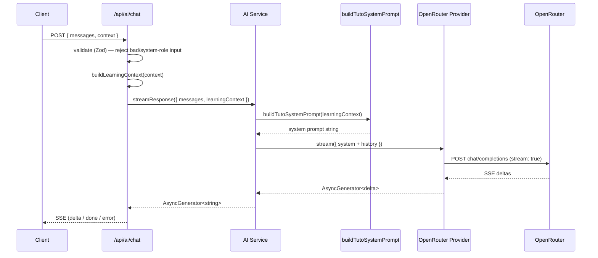

# AI Architecture — Tuto's Foundation

Status: **foundation + context pipeline complete, no conversational
feature wired to a screen yet.** Sprint 1 built the provider/prompt/
service/API plumbing; Sprint 2 (this update) made Tuto context-aware —
richer `LearningContext` fields and a prompt-enrichment renderer that
turns structured context into the labeled block Tuto's system prompt
reads. Neither sprint wires this into a real screen. If you're looking
for a chat UI, there isn't one — `/api/ai/chat` exists and works, but
nothing in the app calls it yet.

Companion to `docs/coding-standards.md` (general conventions) and
`docs/domain-model.md` (the app's actual data model, which the AI module
deliberately does not import from — see "Why the AI module doesn't import
app types" below).

---

## Why this exists

Before this sprint, "AI" in this codebase meant two narrow, non-conversational
things: `src/lib/gemini/client.ts` (a one-shot structured-JSON call the
Content Engine uses to enrich ingested articles/podcasts) and
`src/lib/tuto/messages.ts` (a fully deterministic, rules-based note
generator for the dashboard — no LLM call at all). Neither is reusable for
"Tuto talks back to a learner." This sprint builds that foundation once,
so every future conversational feature is a new call site, never a new
architecture.

---

## The eight pieces

### 1. Providers — `src/ai/providers/`

`AIProvider` (`types.ts`) is the contract: `complete()` for a full
response, `stream()` for an async-generator of text deltas. Everything
above this layer (the service, the API route) only ever talks to this
interface.

`openrouter/client.ts` is the first (and today, only) implementation —
a thin `fetch()` wrapper against OpenRouter's OpenAI-compatible
`chat/completions` endpoint, in both streaming (SSE) and non-streaming
form. `OPENROUTER_API_KEY` and `OPENROUTER_MODEL` are read from
`process.env` on every call — nothing about which model Tuto talks to is
hardcoded; changing `OPENROUTER_MODEL` is a config change, not a deploy.

`registry.ts` + `bootstrap.ts` mirror the Content Engine's own provider
pattern (`src/lib/content-engine/providers/registry.ts` /
`bootstrap.ts`) on purpose, for a reader already familiar with one to
recognize the other immediately: a `Map<id, AIProvider>`, a
`registerProvider()`/`getProvider()` pair, and an idempotent bootstrap
that registers every real provider once per server instance.

`index.ts`'s `getDefaultProvider()` reads `AI_PROVIDER` (defaults to
`"openrouter"`) and returns the matching registered provider. **Adding a
second provider is one new file under `providers/<name>/` plus one line
in `bootstrap.ts` — nothing else changes.**

### 2. Prompts — `src/ai/prompts/tuto/`

`sections.ts` holds each concern (personality, teaching philosophy, CEFR
awareness, grammar correction style, encouragement style, educational
priorities, refusal behavior, formatting rules) as an independent,
named constant — editing how Tuto corrects grammar never touches how it
encourages.

`context-block.ts` (Sprint 2) is the prompt-enrichment renderer: it turns
a `LearningContext` into a labeled-block instruction —

```
User is studying:
Podcast

Podcast title:
Everyday Conversations Vol. 3

Selected sentence:
I couldn't agree more.

User level:
B1

Learning goal:
IELTS 7
```

— rendering only the fields the caller actually populated (never
fabricates a level, goal, or selection that wasn't provided) and
returning `null` for an empty context so no block gets appended at all.
Kept in its own file, separate from `index.ts`'s section-joining, because
it's the piece most likely to grow as more context fields ship.

`index.ts`'s `buildTutoSystemPrompt(context?)` joins the sections, and —
when `context-block.ts` produced one — appends the block under a short
instruction ("Use it naturally in your response — don't just repeat it
back"), directly serving the brief's "The AI should naturally use this
context."

### 3. Context Engine — `src/ai/context/`

`types.ts` defines `LearningContext` (Zod schema + inferred type).
Every field is nullable, optional at the call site, and independent of
every other field — a caller sends only what it actually knows:

| Field | Shape | Notes |
|---|---|---|
| `currentScreen` | `Screen` enum | Home, Podcast, Article, Quiz, Vocabulary, Daily Mission — extend the enum for a new screen, nothing else changes |
| `currentActivity` | `string` | Free-form, e.g. "reading the transcript" — this module doesn't validate its vocabulary |
| `currentLesson` / `previousLesson` | `TitledReference` (`{id, title}`) | Just a pointer — no transcript/body, that's the "no podcast/article analysis" boundary |
| `currentPodcast` / `currentArticle` / `currentQuiz` | `TitledReference` | Same shape, one per content type so the prompt can say "Podcast title" vs "Article title" |
| `selectedWord` / `selectedSentence` / `selectedParagraph` | `string` | Whatever text the learner has selected right now |
| `transcriptTimestamp` | `number` (seconds, ≥0) | Position in an audio/video transcript, if one is playing |
| `userLevel` | `CefrLevel` enum | The module's own A1–C2 union, not the app's |
| `learningGoal` | `string` | Free-form — the AI module doesn't own the canonical goal list |
| `streak` | `number` (int, ≥0) | Consecutive days |
| `xp` | `number` (int, ≥0) | Total experience points |

`builder.ts`'s `buildLearningContext()` normalizes a partial object into
a complete one via `LearningContextSchema.parse()`, defaulting anything
unset to `null` — this is also where an invalid value (a negative streak,
an unrecognized CEFR level) gets rejected, and the same schema backs the
API route's request validation, so a bad `context` in an HTTP request
fails exactly the same way.

**Nothing calls `buildLearningContext()` from a real screen yet** — this
is the architecture, not the wiring. The natural future call sites are
each learning-session step component (`src/components/learning-session/`)
and the dashboard, passing whatever they already know (current CEFR
level, the content on screen, a selected word) into the API request body.

Sprint 1 shipped a single generic `currentContent: {contentType, id,
title}` field instead of the three type-specific fields above — replaced
in Sprint 2 once the brief asked for `currentPodcast`/`currentArticle`/
`currentQuiz` distinctly. Safe to change in place: nothing outside this
module referenced the old field yet.

### 4. Schemas — `src/ai/schemas/`

Zod schemas (and their inferred TypeScript types) for every message shape:
`UserMessageSchema`, `AssistantMessageSchema`, `SystemMessageSchema`, the
`ConversationMessageSchema` discriminated union of all three,
`ToolResultSchema`, and `ConversationContextSchema` (a full request:
message history + optional partial `LearningContext`). These are the
runtime-validated boundary the API route enforces against — see Phase 7
below for why a client-supplied `"system"` message is rejected, not
silently dropped.

### 5. AI Service — `src/ai/services/ai-service.ts`

The single entry point: `generateResponse()` (one full reply) and
`streamResponse()` (an async generator of text deltas). **No UI, no API
route, no future feature should ever import from `src/ai/providers`
directly** — everything goes through this service, which resolves the
active provider, builds Tuto's system prompt from the caller's
`LearningContext`, prepends it to the conversation, and calls the
provider. Swapping providers, changing the system prompt, or adding
memory/tool injection later all happen here, invisibly to every caller.

### 6. Tools — `src/ai/tools/` (scaffolding only)

`ToolDefinition`/`ToolCall` types define the shape a future tool (e.g.
"look up a word's definition," "check the learner's current streak")
must have. `registeredTools` is an empty array today. See "How tools will
work" below for the intended integration point.

### 7. Memory — `src/ai/memory/` (scaffolding only)

`MemoryStore` defines `get(conversationId)` / `set(conversationId,
summary)`. No implementation exists, and the AI Service does not
reference this module at all this sprint — seeing `MemoryStore` imported
anywhere outside `src/ai/memory` today would mean the "no memory
implementation" rule got broken. See "How memory will work" below.

### 8. Actions — `src/ai/actions/` (scaffolding only)

`ActionDefinition` defines the shape of something Tuto could *do* on the
learner's behalf (mark a lesson complete, navigate to a screen) — distinct
from a Tool, which only returns information. `registeredActions` is empty.

### API Route — `src/app/api/ai/chat/route.ts`

`POST /api/ai/chat`. Validates the body against `ChatRequestSchema` (a
Zod union of only `user`/`assistant` messages — a `"system"` role is
rejected with a 400, since Tuto's system prompt is always the service's
own). Normalizes the optional `context` into a full `LearningContext` via
`buildLearningContext()`, then streams the response back as
Server-Sent Events: `data: {"type":"delta","content":"..."}`,
`data: {"type":"done"}`, or — since the HTTP status and headers are
already committed once streaming starts — `data: {"type":"error","message":"..."}`
for any mid-stream failure. Verified locally end to end: malformed JSON →
400, an empty/invalid message array → 400 with field-level detail via
`z.treeifyError()`, a client-sent system message → 400, and a
well-formed request with no `OPENROUTER_API_KEY` configured → a clean SSE
error event rather than a crash.

---

## Request flow



---

## Why the AI module doesn't import app types

`LearningContext.userLevel` is its own `CefrLevel` union
(`"A1"|"A2"|"B1"|"B2"|"C1"|"C2"`), not the app's `CefrLevel` from
`@/types/content`. `currentPodcast`/`currentArticle`/`currentQuiz` are all
the same generic `TitledReference` (`{id, title}`), not a
`PodcastContent`/`ArticleContent`/quiz type — deliberately too thin to
support "podcast analysis" or "article analysis" even by accident. This
is deliberate: the brief was "no feature-specific code," and importing
the app's content types would quietly couple the AI foundation to
whatever those types look like today. The app maps its own types onto
this shape at the call site (once a call site exists) — the AI module
never reaches back into `src/lib/content` or `src/types`.

---

## Future expansion

### How memory will work

`src/ai/memory/types.ts`'s `MemoryStore` interface is the seam. A real
implementation — likely a short conversation summary written back to
Supabase per learner, not a full transcript — would live in
`src/ai/memory/<implementation>.ts`, get registered similarly to how
providers register, and the AI Service would accept an optional
`conversationId`, call `memoryStore.get()` before building the prompt, and
`memoryStore.set()` after a reply completes. Nothing about the service's
public signature (`generateResponse`/`streamResponse`) needs to change to
add this — it's an additive parameter.

### How tools will work

`src/ai/tools/types.ts`'s `ToolDefinition` (`name`, `description`, a JSON
Schema for `parameters`, and `execute()`) is the seam. Once a real tool
exists (e.g. "get the learner's current streak"), `registeredTools` stops
being empty, the OpenRouter provider's `complete()`/`stream()` calls pass
`tools: registeredTools.map(toOpenAiToolSchema)` in the request body, and
the AI Service gains a loop: if the provider's response includes a tool
call, execute the matching `ToolDefinition`, append a `ToolResult` (already
modeled in `src/ai/schemas/tools.ts` and on `AssistantMessage`), and call
the provider again with the result appended — the standard function-calling
loop, not a new concept.

### How RAG will plug in

No vector DB, no embeddings, no retrieval exist today, and none should be
inferred from anything in this module. If/when retrieval is added (e.g.
"find the vocabulary entries most relevant to what the learner just
asked"), the natural seam is `src/ai/context/builder.ts`:
`buildLearningContext()` would gain an optional async retrieval step that
enriches the context object with retrieved snippets *before* it reaches
`buildTutoSystemPrompt()` — the prompt layer and the service layer
wouldn't need to know retrieval happened at all, they'd just see a richer
context object.

---

## Verification performed

### Sprint 1
- `npm run build` — succeeds; `/api/ai/chat` registers as a dynamic route
  alongside every existing route, no regressions.
- `npx eslint src/ai src/app/api/ai` — clean.
- Live smoke test against a local `next start`:
  - Malformed JSON body → `400 { "error": "Invalid JSON body" }`
  - Empty `messages` array → `400` with Zod field-level detail
  - Client-supplied `"system"` role message → `400` (rejected, not silently dropped)
  - Valid request, no `OPENROUTER_API_KEY` set → `200` with a clean
    `data: {"type":"error",...}` SSE event, not a crash
  - Valid request, fake `OPENROUTER_API_KEY`/`OPENROUTER_MODEL` set → confirmed
    the code reaches an actual outbound `fetch()` to `openrouter.ai`
    (blocked only by this sandbox's own network allowlist, not a code
    defect — the same restriction encountered investigating the
    `linguabc.xyz` DNS issue). In production this reaches OpenRouter
    normally.

### Sprint 2
- `npm run build` and `npx tsc --noEmit` — both clean after expanding
  `LearningContext` to the full field set.
- `npx eslint src/ai src/app/api/ai` — clean.
- Unit-level check of `buildTutoSystemPrompt(buildLearningContext(...))`
  with every new field populated (screen, podcast, selected sentence,
  level, goal, streak, XP, transcript timestamp, previous lesson) —
  confirmed the rendered block matches the brief's example format
  exactly, and confirmed an empty context renders no block at all (no
  stray heading, no empty instruction).
- Live smoke test against a local `next start`, through the real
  `POST /api/ai/chat` route (not just the unit-level prompt check):
  - Full rich context (screen, podcast reference, selected sentence,
    level, goal, streak, XP, transcript timestamp) → `200`, streamed
    cleanly, no validation errors.
  - Negative `streak` → `400` with a field-level Zod error.
  - Invalid `userLevel` (`"Z9"`) → `400` with a field-level Zod error.
  - Confirmed SSE headers (`text/event-stream`, chunked) are unaffected
    by the schema change.

## Explicitly out of scope

Per both sprints' briefs: no memory implementation, no RAG, no vector DB,
no database-backed context (streak/XP/level are passed in by the caller,
never queried by this module), no podcast/article/quiz content analysis,
no UI. No screen calls `/api/ai/chat` yet — that's a future sprint, once
a specific feature (and its own scope) is defined.
